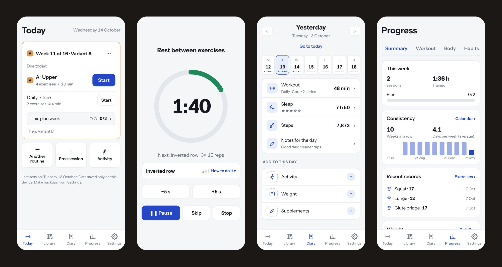
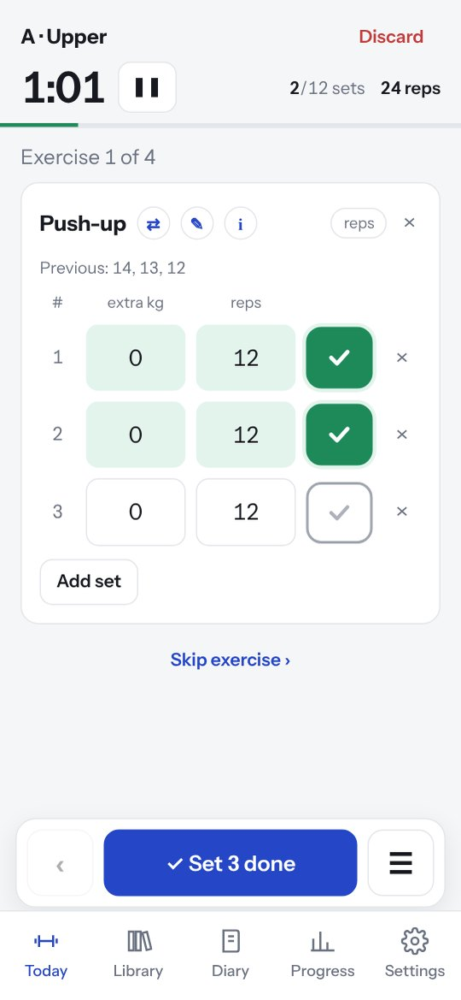

<h1 align="center">Usus</h1>

<b>Calisthenics workout &amp; habit tracker. No accounts, works offline, your data stays on your phone.</b>

<a href="https://oluengo.github.io/usus/">Website</a> · <a href="https://oluengo.github.io/usus/app/">Open the app</a> · <a href="https://github.com/oluengo/usus/releases/latest">Download for Android</a>

**Usus** (Latin: *practice, habit*) logs your workouts and habits. Built for calisthenics and home training; it works for any routine of sets and reps. Free, no ads. In Catalan, Spanish and English.

## What it does

- **Routines** with sets, reps or time, per side, added weight, sections, supersets and circuits. Print them or save them as PDF.
- **Train hands-free:** one exercise per screen and a full-screen countdown with sound or vibration.
- **Progression:** after a session, Usus suggests moving to the next exercise or back to the previous one. You decide.
- **Exercise catalogue** *(optional)*: a card for each one, equipment and progression.
- **Guided plan**, or **with AI** *(optional, external)*: routines at your level and a plan that rotates variants in order, with deloads and pauses.
- **Diary** for sleep, steps, weight, activity and notes, and **Progress** with consistency, PRs and habits.
- **Profiles** for several people, optional **cycle** tracking and light, dark and protector themes.
- **Share** workouts and routines with no servers; backups and CSV.
- **Nostr** *(optional)*: a backup encrypted only for you and posting workouts and routines. Sign in with Amber, a bunker, a browser extension or your npub.

<table><tr>
<td width="25%"></td>
<td width="25%"></td>
<td width="25%"></td>
<td width="25%"></td>
</tr></table>

## Install

| | How |
|---|---|
| **Web and PWA** (iPhone, computer, any phone) | Open <https://oluengo.github.io/usus/app/> and install it from the browser (Safari: Share → “Add to Home Screen”; Chrome/Edge: install icon). |
| **Android** | The APK from the [latest release](https://github.com/oluengo/usus/releases/latest), or add `https://github.com/oluengo/usus` to [Obtainium](https://github.com/ImranR98/Obtainium) to get updates. Also on Zapstore. |
| **Beta** | Web: <https://oluengo.github.io/usus/beta/>. Android: the [Usus Beta](https://github.com/oluengo/usus/releases/tag/usus-beta) pre-release (in Obtainium, “include pre-releases”). Installs separately, with its own data. |

APK certificate SHA-256 fingerprint: `28:B6:FF:4A:8F:61:F6:88:D4:B4:9D:C7:E8:B7:2D:95:D5:D9:44:45:D2:A2:30:07:1A:FA:72:B1:B2:D0:3E:C8`

The web app and the APK keep separate data: move it with a backup (Settings → Data). Permissions and signing: [ANDROID.md](ANDROID.md).

## Privacy

- Everything is stored **only on your device**. No accounts, servers, analytics, ads or trackers.
- Only what you export or share leaves. Without Nostr, Usus connects to nothing.
- With Nostr, the backup is encrypted so only you can read it, and Usus never sees your private key.

Details: [PRIVACY.md](PRIVACY.md).

## Development

A single page (`index.html`, built from `src/`) that runs as a PWA and, packaged with Capacitor, as an APK.

- Code: [src/README.md](src/README.md) · Translations: [i18n/README.md](i18n/README.md) · Android: [ANDROID.md](ANDROID.md)

## Support the project

If you find Usus useful:

- **Lightning / zaps:** `oluengo@rizful.com`
- **Bitcoin:** `bc1pnvdct6hfnh67p7dcg2e5mdveyz8jlxuzv4yflkxqccc72qkuc8ls8raspa`
- **Nostr:** [npub1vuf2g6s0mcjr34lhkg2vvtj4x65w29xn28nznw9fhcqcpyr4zc9q6myguj](https://njump.me/npub1vuf2g6s0mcjr34lhkg2vvtj4x65w29xn28nznw9fhcqcpyr4zc9q6myguj)

---

[Changelog](CHANGELOG.md#english) · [Report a problem](https://github.com/oluengo/usus/issues) · [MIT License](LICENSE)

A logging tool, not medical advice. Built with AI · tested by humans.
